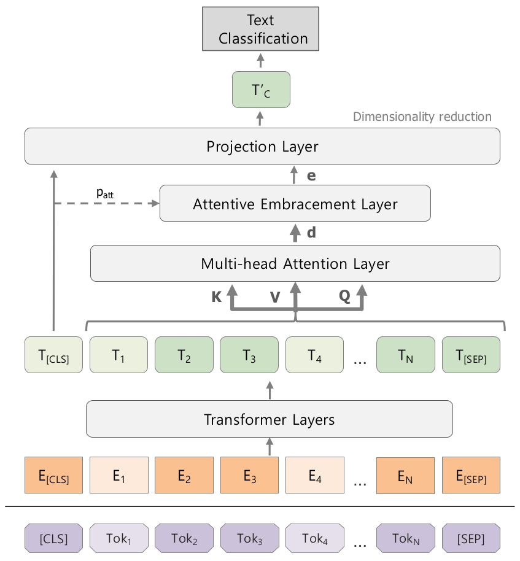
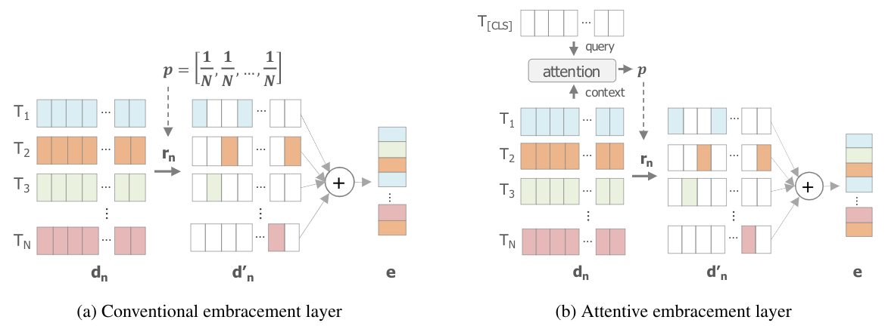
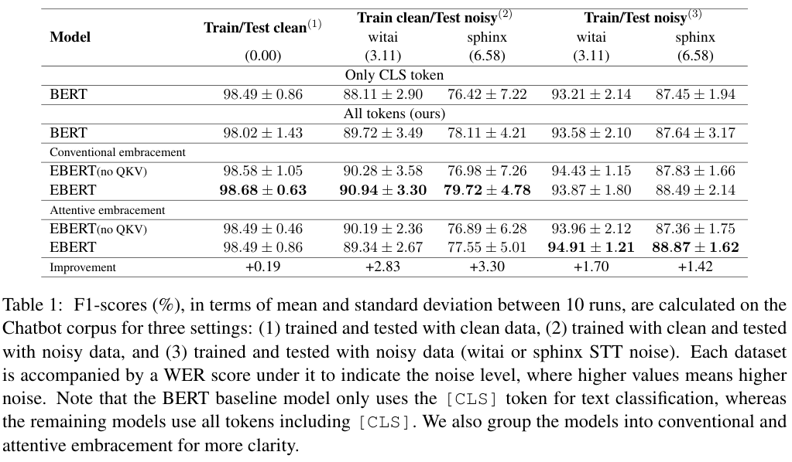

Code for the paper titled *"Attentively Embracing Noise for Robust Latent Representation in BERT"* (To appear at COLING 2020, Dec 8-13 2020)

## About
**EmbraceBERT**: attentive embracement layer for BERT encoded tokens for improved robustness in noisy text classification tasks.

<p align="center">
    
</p>

<p align="center">
    
</p>

* Evaluated on 3 settings:
    1. Trained and tested with complete data
    2. Trained with complete data and tested with incomplete data
    3. Trained and tested with incomplete data

## Contents
[Requirements](#requirements) • [How to Use](#how-to-use) • [Results](#results) • [How to Cite](#acknowledgement)

## Requirements
Tested with Python 3.6.8, PyTorch 1.0.1.post2, CUDA 10.1
```
pip install --upgrade pip
pip install --default-timeout=1000 torch==1.0.1.post2 -f https://download.pytorch.org/whl/torch_stable.html
pip install -r requirements.txt
python -m spacy download en
```

## How to Use
### 1. Dataset
* Open-source NLU benchmarks ([SNIPS](https://github.com/snipsco/nlu-benchmark), [Chatbot](https://github.com/sebischair/NLU-Evaluation-Corpora))
> Ongoing: Ask Ubuntu, Web Applications Corpora

* Already available in the [`data` directory](data) [[more info](https://github.com/gcunhase/IntentClassifier-RoBERTa/data/README.md)] 
> Data with STT error [repository](https://github.com/gcunhase/STTError)

### 2. Train and eval model
* Setting 1: clean data
    * Proposed: `./scripts/settings_1run/run_proposed_setting1_clean.sh`
    * Baseline: `./scripts/settings_1run/run_baseline_setting1_clean.sh`

* Setting 3: noisy data
    * Proposed: `./scripts/settings_1run/run_proposed_setting3_noisy.sh`
    * Baseline: `./scripts/settings_1run/run_baseline_setting3_noisy.sh`

## Results
<p align="left">
    
</p>

> Ablation study on: [Chatbot](./results_notes/chatbot.md) • [Snips](./results_notes/snips.md)

> Ongoing: [AskUbuntu](./results_notes/askubuntu.md) • [WebApplications](./results_notes/webapplications.md) 

> Korean: [Chatbot](./results_notes/chatbot_korean.md)


### Getting paper's ablation study
> The scripts mentioned here will run the model 10 times. If you wish to run it only once, please change the SEED parameter in the script.

#### A. Train Model (settings 1 and 3)

* Proposed: all tokens (BERT, EBERT, EBERTkvq)
    ```
    # BERT with tokens
    ./scripts/[DIR_SETTING_1_OR_3]/run_bertWithTokens_classifier_seeds.sh
    # EBERT
    ./scripts/[DIR_SETTING_1_OR_3]/run_embracebert_classifier_seeds.sh
    # EBERTkvq
    ./scripts/[DIR_SETTING_1_OR_3]/run_embracebert_multiheadattention_bertkvq_classifier_seeds.sh
    ```

* Baseline (BERT)
    ```
    ./scripts/[DIR_SETTING_1_OR_3]/run_bert_classifier_seeds.sh
    ```
    
#### B. Test model with noisy data (setting 2)
```
./scripts/[DIR_SETTING_2]/run_eval_with_incomplete_data.sh
```
> Modify script with the path and type of your model 

## Additional information
### Get mean and std from N runs
Run python script in the [`get_results`](get_results) directory.

### Calculate the number of parameters
> `--do_calculate_num_params`

```
# BERT
python run_classifier.py --seed 1 --task_name chatbot_intent --model_type $MODEL_NAME --model_name_or_path bert-base-uncased --logging_steps 1 --do_calculate_num_params --do_lower_case --data_dir data/intent_processed/nlu_eval/chatbotcorpus/ --max_seq_length 128 --per_gpu_eval_batch_size=1 --per_gpu_train_batch_size=8 --learning_rate 2e-5 --num_train_epochs 3.0 --output_dir ./results/debug_num_params/ --overwrite_output_dir --overwrite_cache --save_best --log_dir ./runs/debug_num_params
# EBERT
python run_classifier.py --seed 1 --task_name chatbot_intent --model_type $MODEL_NAME2 --p $P_TYPE --dimension_reduction_method $DIM_REDUCTION_METHOD --model_name_or_path bert-base-uncased --logging_steps 1 --do_calculate_num_params --do_lower_case --data_dir data/intent_processed/nlu_eval/chatbotcorpus/ --max_seq_length 128 --per_gpu_eval_batch_size=1 --per_gpu_train_batch_size=8 --learning_rate 2e-5 --num_train_epochs 3.0 --output_dir ./results/debug_num_params/ --overwrite_output_dir --overwrite_cache --save_best --log_dir ./runs/debug_num_params
```

| Parameters | Options |
| ---------- | ------- |
| MODEL_NAME | [`bert`, `bertwithatt`, `bertwithattclsprojection`, `bertwithprojection`, `bertwithprojectionatt`] |
| MODEL_NAME2 | [`embracebert`, `embracebertconcatatt`, `embracebertwithkeyvaluequery`, `embracebertwithkeyvaluequeryconcatatt`] |
| DIM_REDUCTION_METHOD | [`attention`, `projection`] |
| P_TYPE | [`multinomial`, `attention_clsquery_weights`] |

### Generated files
| File                              | Description |
| --------------------------------- | ----------- |
| `checkpoint-best-${EPOCH_NUMBER}` | Directory with saved model |
| `eval_results.json`               | JSONified train/eval information |
| `eval_results.txt`                | Train/eval information: eval accuracy and loss, global_step and train loss |

## Acknowledgement
In case you wish to use this code, please cite [To be update]:
```
@inproceedings{sergio2020ebert_coling,
  author    = {Sergio, G. C. and Moirangthem, D. S. and Lee, M.},
  title     = {Attentively Embracing Noise for Robust Latent Representation in BERT},
  year      = {2020},
  booktitle = {The 28th International Conference on Computational Linguistics (COLING 2020)},
  organization={ACL},
  DOI = {},
}
```

Please email me at `gwena.cs@gmail.com` with any requests or questions.

Code based on [HuggingFace's repository](https://github.com/huggingface/transformers), work based on [BERT](https://arxiv.org/pdf/1810.04805.pdf) and [EmbraceNet](https://arxiv.org/abs/1904.09078).
